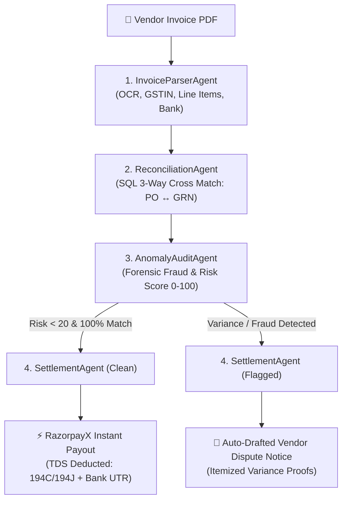

# ⚡ LedgerMind: Autonomous AI Finance Controller & RazorpayX Reconciliation

<div align="center">

[](https://www.python.org/)
[](https://streamlit.io/)
[](https://www.sqlite.org/)
[](https://razorpay.com/x/)
[](https://docs.pydantic.dev/)
[](https://opensource.org/licenses/MIT)

**Track 4: Autonomous AI Finance Controller — Razorpay Buildathon**

*An end-to-end multi-agent system that autonomously audits vendor invoices through 3-way reconciliation (Invoice ↔ PO ↔ GRN), stops billing fraud, and triggers instant RazorpayX payouts with automated TDS tax withholding.*

[Key Features](#-key-features) • [How It Works](#-how-it-works-4-agent-pipeline) • [Tech Stack & Logos](#-tech-stack) • [Quickstart Guide](#-quickstart-guide) • [Test Scenarios](#-test-scenarios)

</div>

---

## 📌 Overview

Accounts Payable teams spend **3–7 days manually cross-referencing vendor invoices** against Purchase Orders and warehouse delivery slips. Small overcharges (+10–25% price inflation) and duplicate submissions quietly slip through, costing enterprises millions annually.

**LedgerMind solves this in under 2 seconds:**
* 🔍 **Reads & Parses:** Ingests PDF/Image invoices and extracts line items, GSTIN, and banking details.
* ⚖️ **3-Way Matching:** Deterministically compares billed items against Purchase Orders (POs) and Goods Received Notes (GRNs).
* 🛡️ **Forensic Fraud Checks:** Scores fraud risk (0–100) to block duplicate resubmissions, rate inflation, and tampered bank details.
* 💳 **Instant Settlement:** Calculates Indian tax withholding (**TDS 194C / 194J**) and dispatches instant **RazorpayX IMPS** payouts for clean invoices.
* 📧 **Auto-Disputes:** Generates itemized, mathematical dispute notices for flagged invoices in one click.

---

## 🛠️ Tech Stack & Integrations

<div align="center">

| Category | Technologies & Frameworks |
| :--- | :--- |
| **Frontend & UI** |    |
| **Core & Backend** |    |
| **Document Processing** |    |
| **Fintech & Tax** |   |
| **AI / LLM Engines** |    |

</div>

---

## 🤖 How It Works (4-Agent Pipeline)



### The 4 Multi-Agent Stages:
1. **`InvoiceParserAgent`**: Ingests PDF/Images, parses complex tables, and extracts structured line items, vendor GSTIN, and bank IFSC using `pdfplumber` layout parsing with cloud LLM fallback.
2. **`ReconciliationAgent`**: Queries the ERP database (`purchase_orders`, `po_items`, `goods_received_notes`) to calculate rate variances ($\Delta\text{Rate}$), quantity variances ($\Delta\text{Qty}$), and total monetary leakage.
3. **`AnomalyAuditAgent`**: Scores risk (0–100) across 5 dimensions: duplicate ledger detection, price inflation thresholds, GSTIN format compliance, and unverified bank account changes.
4. **`SettlementAgent`**:
   * **Approved:** Automatically deducts Section 194C (2%) or 194J (10%/2%) TDS, computes net settlement, and executes an automated RazorpayX payout generating a bank UTR and webhook payload.
   * **Disputed:** Puts payments on hold and auto-drafts an itemized dispute email with line-item proofs for 1-click dispatch.

---

## ✨ Key Features

* 🚀 **Zero-API Offline Mode:** Includes a deterministic heuristic table parser that runs 100% locally with zero cloud API keys.
* ⚖️ **Strict 3-Way Reconciliation:** Matches Invoice $\leftrightarrow$ Purchase Order $\leftrightarrow$ Warehouse Goods Received Note (GRN).
* 🛡️ **Forensic Risk Scoring:** Real-time fraud detection for duplicate invoice resubmissions and beneficiary account tampering.
* 🇮🇳 **Automated Indian Tax (TDS) Compliance:** Automated deduction under Section 194C (Contracts/Logistics @ 2%) and Section 194J (Tech Services @ 10%/2%).
* 📊 **Executive CFO Dashboard:** Real-time analytics on saved leakage, audit volume distributions, and vendor risk profiles.
* ⚡ **1-Click Batch Benchmarking:** Built-in test suite to audit all 5 scenarios simultaneously in seconds.

---

## 🧪 Test Scenarios

The repository includes pre-built PDF invoices in `samples/` to demonstrate different real-world conditions:

| # | Scenario | Sample File | Reconciliation Status | Risk Score | Action Taken |
| :-: | :--- | :--- | :---: | :---: | :--- |
| **1** | **Standard Clean Match** | `invoice_perfect_match.pdf` | `PERFECT_MATCH` | `0 / 100` (Low) | **Instant RazorpayX Payout** (TDS deducted, UTR generated) |
| **2** | **Rate Variance Overbilling** | `invoice_rate_mismatch.pdf` | `PRICE_MISMATCH` | `55 / 100` (Medium) | **Payment Held** + Auto-drafted ₹24,780 rate dispute notice |
| **3** | **Duplicate Resubmission Fraud** | `invoice_duplicate_fraud.pdf` | `DUPLICATE` | `95 / 100` (Critical) | **Payment Blocked** (Cryptographic duplicate fraud alert) |
| **4** | **Qty Mismatch & Bank Change** | `invoice_qty_and_bank_tamper.pdf` | `QTY_MISMATCH` | `45 / 100` (Medium) | **Payment Held** + Bank tampering forensic alert |
| **5** | **Unregistered Vendor** | `invoice_unauthorized_vendor.pdf` | `UNAUTHORIZED_VENDOR`| `65 / 100` (High) | **Payment Blocked** (Invalid GSTIN & unmatched PO) |

---

## 🚀 Quickstart Guide

### Prerequisites
* Python 3.10 or higher
* Git

### 1. Clone the Repository
```bash
git clone https://github.com/aman7052/Track-4-Razorpay-ledgermind-AI_Finance_Controller.git
cd Track-4-Razorpay-ledgermind-AI_Finance_Controller
```

### 2. Install Dependencies
```bash
pip install -r requirements.txt
```

### 3. Initialize Database & Generate Test Invoices
```bash
python seed_db.py
```

### 4. Run Automated Test Suite
```bash
python tests/test_pipeline.py
```

### 5. Launch the Dashboard
```bash
streamlit run app.py
```
*(On Windows, you can also double-click **`run_app.bat`** for a 1-click startup)*

Open your browser at **`http://localhost:8501`**.

---

## ⚙️ Configuration & Environment Variables (Optional)

LedgerMind runs **completely offline out-of-the-box** using its built-in heuristic parser.

If you wish to enable cloud LLMs (OpenAI, Gemini, Groq, Ollama), copy `.env.example` to `.env`:
```bash
cp .env.example .env
```

Fill in any optional API keys you want to use:
```env
OPENAI_API_KEY=your_openai_key_here
GEMINI_API_KEY=your_gemini_key_here
GROQ_API_KEY=your_groq_key_here
OLLAMA_BASE_URL=http://localhost:11434
```

---

## 📂 Project Architecture

```
Track-4-Razorpay-ledgermind-AI_Finance_Controller/
├── app.py                      # Main Streamlit web application
├── seed_db.py                  # Database initialization & sample data generator
├── generate_sample_pdfs.py     # PDF invoice generator using ReportLab
├── ledgermind.db               # SQLite database
├── requirements.txt            # Python dependencies
├── run_app.bat                 # Windows 1-click startup script
│
├── agents/                     # 4 Autonomous Agents
│   ├── workflow.py             # Master Multi-Agent Controller
│   ├── invoice_parser.py       # Document OCR & schema extractor
│   ├── reconciliation.py       # 3-Way matching logic (Invoice ↔ PO ↔ GRN)
│   ├── anomaly_auditor.py      # Forensic fraud & risk scoring engine
│   └── settlement.py           # RazorpayX payout trigger & dispute composer
│
├── database/                   # Database Layer
│   └── db.py                   # SQLite schema, tables & connection pools
│
├── schemas/                    # Pydantic Schemas
│   └── models.py               # Strict typing for invoices, matches, risk & payouts
│
├── services/                   # Backend Services
│   ├── llm_factory.py          # LLM router with offline heuristic fallback
│   ├── razorpay_mock.py        # RazorpayX payout engine with TDS calculation
│   └── email_service.py        # Itemized dispute notice composer
│
├── samples/                    # Pre-generated test PDF invoices
├── tests/                      # Automated Test Suite
│   └── test_pipeline.py        # 100% pass-rate end-to-end integration tests
│
└── ui/                         # UI Styling & Components
    ├── styles.py               # Dark fintech stylesheet
    └── components.py           # Metric cards, timeline, diff table & receipt
```

---

## 📄 License
This project is licensed under the **MIT License** — feel free to use, modify, and distribute for your own projects.
